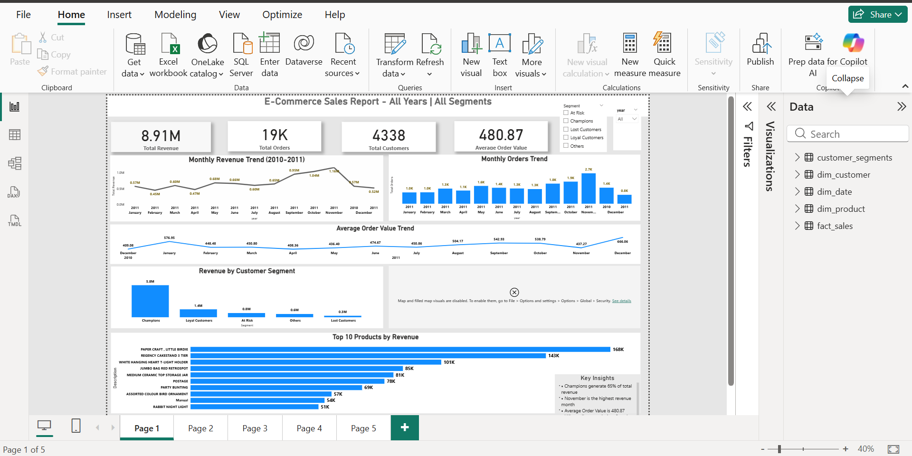

# ecommerce-sales-analytics-dashboard
End-to-end data analytics project using SQL and Power BI including data cleaning, star schema modeling, RFM segmentation and interactive dashboard.
## Dashboard Preview

📊 Project Overview
This project analyzes an e-commerce retail dataset to understand sales performance, customer behavior, and revenue drivers.

The analysis includes:
• Data cleaning and transformation using SQL
• Dimensional modelling using a Star Schema
• Customer segmentation using RFM analysis
• Business insights through Power BI dashboard

The goal is to help businesses identify high-value customers, revenue trends, and growth opportunities.

🛠 Tools & Technologies
• SQL (MySQL) – Data cleaning and analysis
• Power BI – Data modeling and dashboard creation
• GitHub – Project documentation and version control

🗂 Data Model
The project follows a Star Schema structure.

Fact Table
• fact_sales – Contains transaction level sales data

Dimension Tables
• dim_customer – Customer details
• dim_product – Product information
• dim_date – Date dimension for time analysis

This model improves query performance and enables scalable analytics

👥 Customer Segmentation (RFM Analysis)
Customers were segmented using the RFM model:

• Recency – How recently the customer purchased
• Frequency – How often the customer purchases
• Monetary – Total spending by the customer

Segments created:
• Champions
• Loyal Customers
• At Risk
• Lost Customers
• Others

This helps businesses target marketing campaigns effectively.

🔎 Key Insights
• Champions generate ~65% of total revenue
• Loyal Customers contribute ~16% of revenue
• A small percentage of customers drive the majority of sales
• Revenue peaks during November and December, indicating seasonal demand

💡 Business Recommendations
• Provide loyalty rewards to Champions to retain high-value customers
• Re-engage At Risk customers through targeted campaigns
• Upsell products to Loyal Customers to increase revenue
• Prepare inventory for peak sales during holiday months

## 📁 Repository Structure
ecommerce-sales-analytics-dashboard
│
├── sql
│   ├── 01_data_cleaning.sql
│   ├── 02_star_schema.sql
│   ├── 03_rfm_segmentation.sql
│   └── 04_business_analysis.sql
│
├── dashboard.png
├── ecommerce_dashboard.pbix
└── README.md

